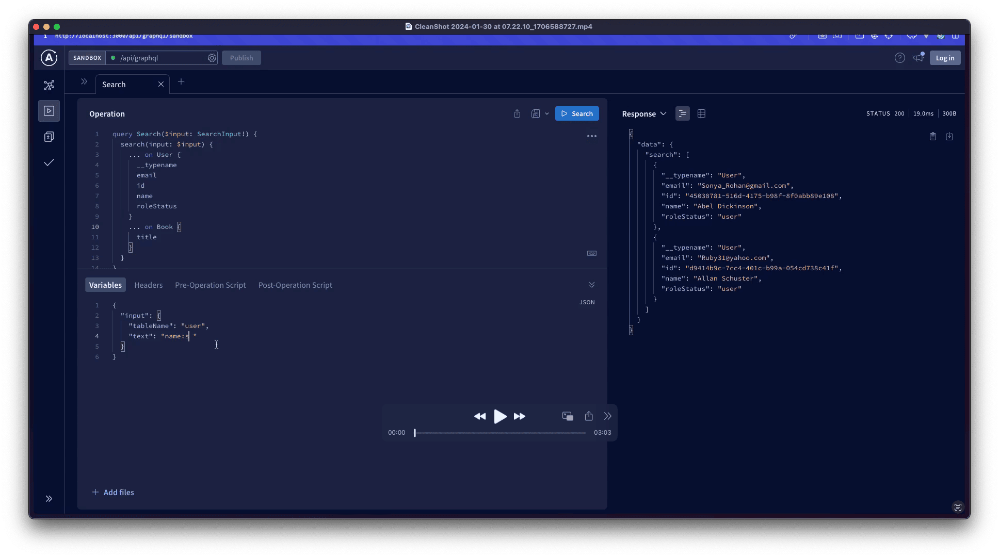

# unsearch

unsearch is a simple library designed to add flexible search functionality to your own APIs and databases.

## Features

- Pluggable architecture
  - Plugins
    - [x] andScope / AND
    - [x] orScope / OR
    - [x] orderByScope / asc:xx, desc:xx asc:[xx, xx], desc:[xx, xx]
    - [x] textScope / hello world
    - [x] twoPointScope / xx:xx yy:yy
    - [ ] limitScope
    - [ ] offsetScope
- key:value scope search
- asc:key or desc:key sort search
- limit:count limit search (soon)
- offset:count offset search (soon)
- key:value OR key:value orScope search
- key:value AND key:value andScope search

<p>
      <a href="https://www.npmjs.com/package/unsearch"></a>
      <a href="https://www.npmjs.com/package/unsearch"></a>
      <a href="./LICENSE"></a>
      <a href="https://github.com/productdevbook/unsearch">
       </a>
</p>

## Video

[](https://github.com/productdevbook/unsearch/raw/main/.github/assets/video.mp4)

## Installation

```bash
pnpm add unsearch
```

## Usage

- [Drizzle ORM Example](/playground/drizzle.ts)

### Search Text
Here is an example of a search text.

```ts
const example1 = 'name:john'
const example2 = 'name:john age:20'
const example3 = 'name:john age:20 OR name:doe age:30'
const example4 = 'name:john age:20 AND name:doe age:30'
const example5 = 'name:john asc:age'
const example6 = 'name:john desc:age'
const example8 = 'name:john AND email:test@gmail.com asc:age name:doe OR age:30'
const example7 = 'name:john asc:age limit:10' // soon
```

## TODO

- [ ] Add limitScope
- [ ] Add offsetScope
- [ ] Usege examples
  - [ ] Prisma
  - [ ] TypeORM
  - [ ] Sequelize
  - [ ] Knex
  - [ ] Postgres
  - [ ] MySQL
  - [ ] MongoDB
  - [ ] SQLite
  - [ ] MariaDB
- [ ] Add more tests
- [ ] Add more docs

## Development

1. To use this template, click the "Use this template" button above.
2. Clone the repository to your local machine.
3. Run `pnpm install` to install the dependencies.
4. Run `pnpm build` to build the bundle.
5. Run `pnpm start` to start the bundle.
6. Run `pnpm lint` to lint the code. (You can also run `pnpm lint:fix` to fix the linting errors.)
7. Run `pnpm test` to run the tests. (You can also run `pnpm test:watch` to run the tests in watch mode.)
8. Run `pnpm release` to bump the version. Terminal will ask you to select the version type. And then it will automatically commit and push the changes. GitHub Actions will automatically publish git tags. NPM local registry will automatically publish the package.

## Configuration

### Renovate

[Setup Github App](https://github.com/apps/renovate) for Renovate.

### TS Config Base

(tsconfig.json)[https://github.com/tsconfig/bases/tree/main/bases] is used as the base config for the Typescript compiler.

## Sponsors

<p align="center">
  <a href="https://cdn.jsdelivr.net/gh/oku-ui/static/sponsors/sponsors.svg">
    
  </a>
</p>

## License

MIT License © 2022-PRESENT [productdevbook](https://github.com/productdevbook)
